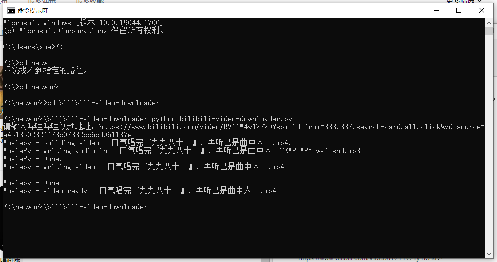

# Bilibili-Video-Downloader
### 一个下载B站视频的小工具

#### 一、背景  
在日常生活中，我们经常在B站看到有趣的视频，然而我们发现在网页端，视频没有下载的方式，在手机端缓存的视频由于格式限制也只能用哔哩哔哩打开，这就造成了很大的不便。本项目旨在解决这一问题，使得用户可以通过url直接获取MP4格式的视频，从而可以在任意设备上播放。

#### 二、安装相关依赖
我们的项目基于beautifulsoup抓包工具和moviepy视频音频处理工具，使用pip安装上述依赖包：  

- pip install beautifulsoup4
- pip install moviepy

#### 三、下载本项目

- git clone https://github.com/13luoyu/bilibili-video-downloader

#### 四、使用python运行项目
我们以下载UP咻咻满的《孤勇者》为例，说明工具的运行  

- python bilibili-video-downloader.py
- 从B站复制视频地址到对话框中，如 https://www.bilibili.com/video/BV11W4y1k7kD?spm_id_from=333.337.search-card.all.click&vd_source=e451850282ff73c07332cc6cd961137e

运行过程及过程如下图所示：

下载好的视频也一同上传

#### 五、其他
- 项目在2022年6月测试通过，由于今后B站网页内容可能会改变，因此基于抓包的本工具也可能随时失去作用  
- 欢迎使用和传播，欢迎pull requests
